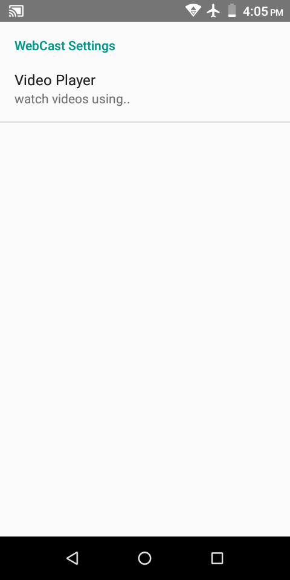
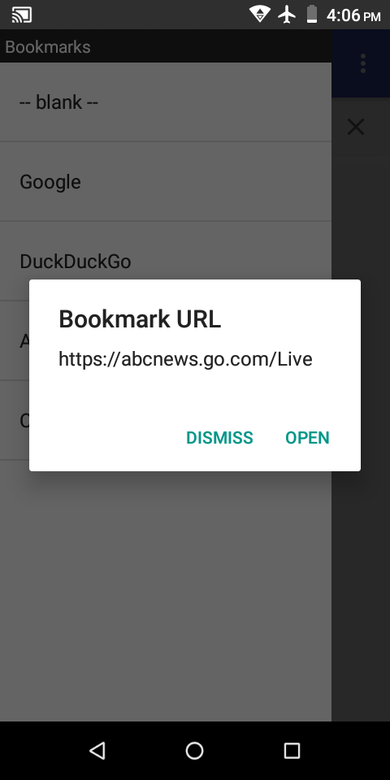
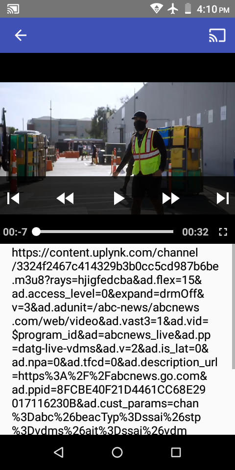
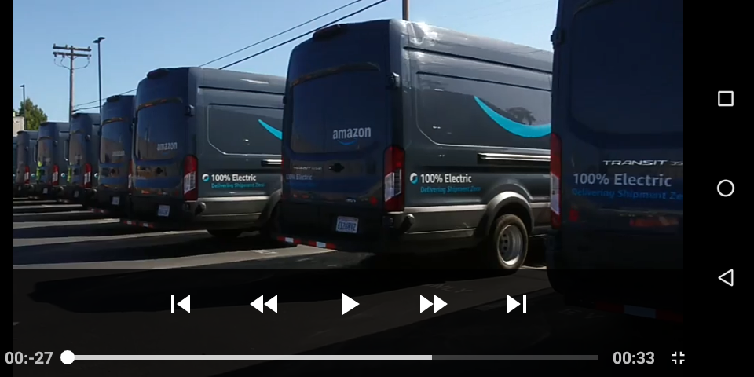
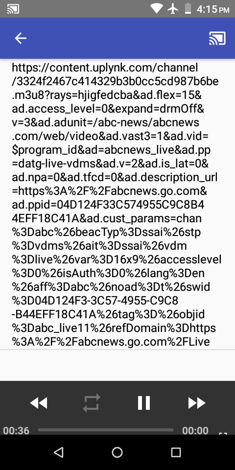

### [WebCast](https://github.com/warren-bank/Android-WebCast/tree/05-webcast-filename-media3)

Android app to extract video (file/stream) URLs from websites and watch them elsewhere (internal/external video player, Google Chromecast, [ExoAirPlayer](https://github.com/warren-bank/Android-ExoPlayer-AirPlay-Receiver)).

  
Screenshots..

  
  
  
  
  
  
  
  
  
  
  
  
  
  
  
  
  
  

- - - -

#### Tour

* `BrowserActivity` is shown when the app is started, and includes:
  - a very basic web browser
    * address bar
    * `WebView`
  - actionbar icons:
    * _bookmark_ toggle
      - add/remove current website URL to/from list of persistently saved __Bookmarks__
  - actionbar menu items:
    * _Bookmarks_
      - open drawer on left: __Bookmarks__
    * _Videos_
      - open drawer on right: __Videos__
    * _Settings_
      - open `SettingsActivity`
    * _Exit_
      - close all UI and exit the app
  - drawer on left: __Bookmarks__
    * contains a persistent list of:
      - website URLs that have been saved via the _bookmark_ toggle icon
      - video URLs that have been saved via the __Videos__ drawer
    * click a list item to:
      - open website URL in WebView
      - watch video URL
        * `SettingsActivity` determines the particular action to be performed
    * long click a list item to:
      - rename
      - delete
  - drawer on right: __Videos__
    * contains a transient list of video URLs that have been found on the web page that is currently loaded in the `WebView`
      - this list is cleared each time the `WebView` navigates to a new web page
    * click a list item to:
      - add video URL to list of persistently saved __Bookmarks__
      - watch video URL
        * `SettingsActivity` determines the particular action to be performed
    * long click a list item to:
      - delete
* `SettingsActivity` is started from the actionbar menu in `BrowserActivity`, and includes:
  - _Video Player_ to select whether to watch videos using..
    * internal w/ Chromecast sender
      - start `VideoActivity`
    * external
      - start Activity chooser w/ an implicit Intent
        * action
          - `android.intent.action.VIEW`
        * data
          - video URL
        * type
          - mime-type for format of video
        * extras
          - `referUrl`
            * (String) referer URL
            * used by [ExoAirPlayer](https://github.com/warren-bank/Android-ExoPlayer-AirPlay-Receiver)
    * [ExoAirPlayer](https://github.com/warren-bank/Android-ExoPlayer-AirPlay-Receiver) sender
      - start `ExoAirPlayerSenderActivity`
    * [HLS-Proxy](https://github.com/warren-bank/HLS-Proxy) configuration
      - start Activity chooser w/ an implicit Intent
        * action
          - `android.intent.action.VIEW`
        * data
          - `http://webcast-reloaded.surge.sh/proxy.html#/watch/${base64_video}/referer/${base64_referer}`
        * type
          - "text/html"
      - start `HlsProxyConfigurationActivity`
        * only when there is no Activity having a matching Intent filter
          - which should never happen, since any standard web browser should offer to handle this Intent
* `VideoActivity` is started when a video URL is watched using the internal video player, and includes:
  - [ExoPlayer](https://github.com/google/ExoPlayer/tree/release-v2)
    * displays an icon in lower right corner of video controls toolbar to toggle fullscreen mode on/off
  - [Chromecast sender](https://github.com/google/ExoPlayer/tree/release-v2/extensions/cast)
    * displays an actionbar _cast_ icon when at least one Google Chromecast is detected on LAN
    * when connected to a Chromecast
      - video URLs are communicated to the receiver app running in the Chromecast
      - the Chromecast receiver app loads the video URL in an embedded HTML5 video player
        * transfer of video data occurs directly between the Chromecast and the server that hosts the video URL
        * transfer would not be effected by any of the following events:
          - `VideoActivity` stopped
          - `BrowserActivity` stopped
          - [WebCast](https://github.com/warren-bank/Android-WebCast/tree/05-webcast-filename-media3) app exited
          - Android device powered off
  - list of video URLs
    * click a list item to:
      - play video URL
        * if connected to a Chromecast:
          - on Chromecast
        * otherwise:
          - on Android, in _ExoPlayer_
            * all HTTP requests include the referer url
* `ExoAirPlayerSenderActivity` is started when a video URL is watched using the [ExoAirPlayer](https://github.com/warren-bank/Android-ExoPlayer-AirPlay-Receiver) sender, and includes:
  - `WebView` that loads a single web page
    * URL of the web page depends on version of Android
      - Android 5.0 and newer
        * [version using ES6+ modern javascript](http://webcast-reloaded.surge.sh/airplay_sender.html)
      - Android 4.x and older
        * [version using ES5 compliant javascript](http://webcast-reloaded.surge.sh/airplay_sender.es5.html)
    * URL hash contains:
      - `#/watch/${base64_video}/referer/${base64_referer}`
  - web page reads data from URL hash and pre-populates fields:
    * video url
    * referer url
  - web page reads data from cookies and pre-populates fields:
    * host
    * port
    * https
  - provides a basic UI to control any [ExoAirPlayer](https://github.com/warren-bank/Android-ExoPlayer-AirPlay-Receiver) receiver app that is reachable through the network
* `HlsProxyConfigurationActivity` is started when a video URL is watched using [HLS-Proxy](https://github.com/warren-bank/HLS-Proxy) configuration on a device without any available web browser, and includes:
  - `WebView` that loads an ES5 compliant [web page](http://webcast-reloaded.surge.sh/proxy.html)
    * URL hash contains:
      - `#/watch/${base64_video}/referer/${base64_referer}`
  - web page reads data from URL hash and pre-populates fields:
    * video url
    * referer url
  - web page reads data from cookies and pre-populates fields:
    * host
    * port
    * https
  - clicking the _Load Player_ button performs the following tasks:
    * configures a new video URL that redirects the HLS manifest through [HLS-Proxy](https://github.com/warren-bank/HLS-Proxy)
    * redirects `WebView` to another ES5 compliant [web page](http://webcast-reloaded.surge.sh/index.html) that provides optional endpoint destinations for the proxied HLS manifest
      - [ES6 web page](http://webcast-reloaded.surge.sh/airplay_sender.html) for [ExoAirPlayer](https://github.com/warren-bank/Android-ExoPlayer-AirPlay-Receiver) sender
      - [ES5 web page](http://webcast-reloaded.surge.sh/chromecast_sender.html) for _Chromecast sender_
        * in `WebView` on Android 4.x and older:
          - video player functionality does not work
        * in `WebView` on Android 5.0 and newer:
          - video player functionality works
          - _Chromecast sender_ functionality does not work

- - - -

#### Important Caveats

* some video URLs may play in [WebCast](https://github.com/warren-bank/Android-WebCast/tree/05-webcast-filename-media3) and [ExoAirPlayer](https://github.com/warren-bank/Android-ExoPlayer-AirPlay-Receiver), but cannot play on Chromecast or other external video players
  - this can occur when a video URL is hosted by a server that uses the `Referer` HTTP request header to restrict access, which is a common strategy
    * [WebCast](https://github.com/warren-bank/Android-WebCast/tree/05-webcast-filename-media3) and [ExoAirPlayer](https://github.com/warren-bank/Android-ExoPlayer-AirPlay-Receiver) have the functionality to configure the value of this header for each unique video URL
    * Chromecast receiver apps cannot change the value of this header because they are restrained by standard browser security policies
      - the specs for [XHR](https://xhr.spec.whatwg.org/#dom-xmlhttprequest-setrequestheader) and [fetch](https://fetch.spec.whatwg.org/#forbidden-header-name) forbid changing certain HTTP request headers, including `Referer`
      - the [WebCast Chromecast receiver app](https://github.com/warren-bank/Android-WebCast/tree/00-chromecast-receiver-app)
        * [attempts](https://github.com/warren-bank/Android-WebCast/blob/00-chromecast-receiver-app/CastReceiver/js/receiver.js#L42) to change the value of this header
        * [reveals](https://github.com/warren-bank/Android-WebCast/blob/00-chromecast-receiver-app/notes.txt#L122) in the remote debugger console that this attempt raises the warning:
          - _Refused to set unsafe header "referer"_
    * other external video players would need to:
      - read the `referUrl` extra in the starting Intent
      - configure its HTTP client library to change the value of this header
    * [HLS-Proxy](https://github.com/warren-bank/HLS-Proxy) provides a convenient general-purpose workaround
      - setup for integration with [WebCast](https://github.com/warren-bank/Android-WebCast/tree/05-webcast-filename-media3):
        1. install [HLS-Proxy](https://github.com/warren-bank/HLS-Proxy)
           * `npm install --global "@warren-bank/hls-proxy"`
        2. install [WebMonkey](https://github.com/warren-bank/Android-WebMonkey)
           * app to open [HLS-Proxy](https://github.com/warren-bank/HLS-Proxy) configuration
        3. in [WebMonkey](https://github.com/warren-bank/Android-WebMonkey)
           * install [WebCast-Reloaded userscript](https://github.com/warren-bank/crx-webcast-reloaded/raw/gh-pages/external_website_helper/external_website_webmonkey.user.js)
             - adds enhanced functionality to the ES5 compliant [web page](http://webcast-reloaded.surge.sh/proxy.html) that provides [HLS-Proxy](https://github.com/warren-bank/HLS-Proxy) configuration
               * enables a button labeled: _Start App_
               * when clicked:
                 - start Activity chooser w/ an implicit Intent
                   * action
                     - `android.intent.action.VIEW`
                   * data
                     - proxied HLS manifest URL
                   * type
                     - "application/x-mpegurl"
        4. in [WebCast](https://github.com/warren-bank/Android-WebCast/tree/05-webcast-filename-media3)
           * _Settings_ &gt; _Video Player_ &gt; _HLS-Proxy configuration_
      - usage:
        1. run [HLS-Proxy](https://github.com/warren-bank/HLS-Proxy)
           * `hlsd --port 8080 --req-insecure --useragent "Chrome/90"`
        2. in [WebCast](https://github.com/warren-bank/Android-WebCast/tree/05-webcast-filename-media3)
           * navigate internal `WebView` to a page having the desired HLS video stream
           * open the __Videos__ drawer (on right)
           * click on the URL for the desired HLS video stream
           * click: _Watch_
             - an Activity chooser will start
             - [WebMonkey](https://github.com/warren-bank/Android-WebMonkey) will be included in the list of apps that contain a matching Activity
             - click: _WebMonkey_
        3. in [WebMonkey](https://github.com/warren-bank/Android-WebMonkey)
           * configure the location of your running instance of [HLS-Proxy](https://github.com/warren-bank/HLS-Proxy):
             - host
             - port
             - https
           * click: _Start App_
             - an Activity chooser will start
             - [WebCast](https://github.com/warren-bank/Android-WebCast/tree/05-webcast-filename-media3) will be included in the list of apps that contain a matching Activity
             - click: _WebCast Video Player_
        4. in [WebCast](https://github.com/warren-bank/Android-WebCast/tree/05-webcast-filename-media3)
           * click the  _Chromecast sender_ icon to cast the proxied HLS video stream to a Chromecast device

* the Android System [`WebView`](https://developer.chrome.com/multidevice/webview/overview) component is wholly responsible for the web browser experience
  - this component has a complicated history
  - without going into detail:
    * on versions of Android &lt; 5.0
      - the `WebView` component is baked into the firmware
        * cannot be updated
        * does a poor job loading modern webpages, as the javascript language (ES6+) and html spec (HTML5) have changed significantly
    * on versions of [Android &gt;= 5.0](https://developer.android.com/about/versions/lollipop#WebView)
      - the `WebView` component is a [standalone application](https://play.google.com/store/apps/details?id=com.google.android.webview)
        * can be updated
    * on versions of [Android &gt;= 7.0](https://developer.android.com/about/versions/nougat/android-7.0#webview)
      - the `WebView` component is superseded by a component of the [Google Chrome web browser](https://play.google.com/store/apps/details?id=com.android.chrome), when it is installed and enabled
        * can be updated

- - - -

#### Organization of Git Repo

* __stale branches__
  - [01-foundation](https://github.com/warren-bank/Android-WebCast/tree/01-foundation)
    * collection of small apps to develop and test experimental features
  - [02-webcast-httpclient](https://github.com/warren-bank/Android-WebCast/tree/02-webcast-httpclient)
    * used an external HTTP client library: [Apache HttpClient](https://hc.apache.org/httpcomponents-client-4.3.x/index.html)
    * used the `Content-Type` response header to detect video files
  - [03-webcast-okhttp](https://github.com/warren-bank/Android-WebCast/tree/03-webcast-okhttp)
    * used an external HTTP client library: [okhttp](https://github.com/square/okhttp)
    * used the `Content-Type` response header to detect video files
  - [04-webcast-filename](https://github.com/warren-bank/Android-WebCast/tree/04-webcast-filename)
    * uses `WebView` to download all HTTP requests
    * uses regular expressions to detect file extensions associated with video formats in URL requests
* __active branches__
  - [05-webcast-filename-media3](https://github.com/warren-bank/Android-WebCast/tree/05-webcast-filename-media3)
    * uses `WebView` to download all HTTP requests
    * uses regular expressions to detect file extensions associated with video formats in URL requests
    * builds upon the [04-webcast-filename](https://github.com/warren-bank/Android-WebCast/tree/04-webcast-filename) branch, and migrates from [ExoPlayer](https://github.com/google/ExoPlayer) to [AndroidX Media3](https://github.com/androidx/media)
  - [00-chromecast-receiver-app](https://github.com/warren-bank/Android-WebCast/tree/00-chromecast-receiver-app)
    * WebCast Chromecast receiver app
  - [gh-pages](https://github.com/warren-bank/Android-WebCast/tree/gh-pages)
    * WebCast Chromecast receiver app
      - the _HEAD_ of this branch should always reference/alias the _HEAD_ of the [00-chromecast-receiver-app](https://github.com/warren-bank/Android-WebCast/tree/00-chromecast-receiver-app) branch
    * [hosted](https://warren-bank.github.io/Android-WebCast/CastReceiver/receiver.html) by [GitHub Pages](https://pages.github.com/)

#### Highlights of Source Code

* __identification of video URLs in outbound HTTP requests__
  - [`BrowserWebViewClient`](https://github.com/warren-bank/Android-WebCast/blob/v04.09.10/android-studio-project/WebCast/src/main/java/com/github/warren_bank/webcast/webview/BrowserWebViewClient.java#L15)
    * [regex to detect video files](https://github.com/warren-bank/Android-WebCast/blob/v04.09.10/android-studio-project/WebCast/src/main/java/com/github/warren_bank/webcast/SharedUtils.java#L8)
* __same methodology as implemented by a web browser extension__
  - ["WebCast-Reloaded" Chromium extension](https://github.com/warren-bank/crx-webcast-reloaded)
    * [regex to detect video files](https://github.com/warren-bank/crx-webcast-reloaded/blob/v0.7.4/chrome_extension/2-release/background/js/background.js#L62)

- - - -

#### Legal

* copyright: [Warren Bank](https://github.com/warren-bank)
* license: [GPL-2.0](https://www.gnu.org/licenses/old-licenses/gpl-2.0.txt)
